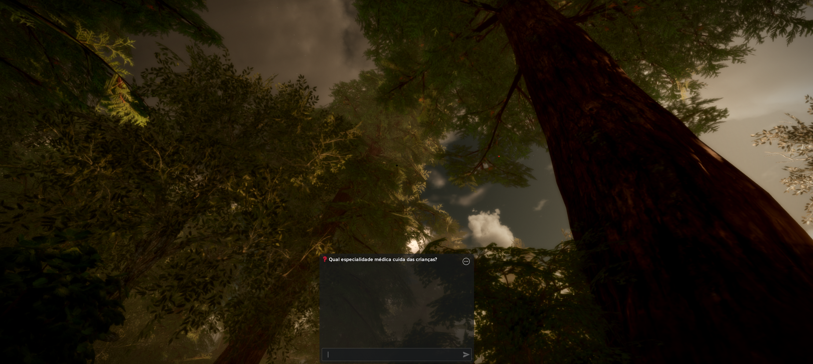

# Ilha do Milhão

**Ilha do Milhão** é um jogo em primeira pessoa (FPS) inspirado no clássico "Show do Milhão", desenvolvido em Roblox 3D com gráficos realistas e um sistema de perguntas e respostas dinâmico alimentado pela IA DeepSeek.

---

## 🎮 Visão Geral

* **Plataforma:** Roblox (3D)
* **Gênero:** FPS + Quiz interativo
* **IA Integrada:** DeepSeek (respostas, dicas e alternativas geradas e analisadas dinamicamente)

---

## 📝 Enredo

Você é **Sofia**, uma mulher que acorda em uma ilha remota e misteriosa. Para sobreviver e escapar, é preciso:

1. **Enfrentar inimigos** eliminando-os com suas habilidades de FPS.
2. **Responder perguntas** e escolher alternativas corretas para desbloquear portais, bônus e armas especiais.
3. **Gerenciar recursos**: cada comando interativo (`Ajuda!`, `Dica!`, `pular!`, `universitarios!`) gera uma pontuação/valor que impacta o resultado final da partida.

---

## ⚙️ Mecânicas de Jogo

1. **Perguntas Dinâmicas**

   * O jogo exibe uma pergunta diretamente no chat.
   * As alternativas são geradas e validadas em tempo real pela IA DeepSeek.

2. **Combate FPS**

   * Inimigos surgem na ilha enquanto o jogador responde.
   * Acertos eliminam inimigos; erros penalizam vida e tempo.

3. **Sistema de Pontuação**

   * Cada ação de auxílio (`Ajuda!`), dica (`Dica!`), pular pergunta (`pular!`) ou sugestão extra (`universitarios!`) impacta sua pontuação final.

---

## 💬 Comandos Disponíveis

* `Ajuda!`
  Solicita auxílio geral da IA.

* `Dica!`
  Gera uma dica complementar. Use com moderação!

* `pular!`
  Pula a pergunta atual, mas pode gerar penalidade.

* `universitarios!`
  Recebe um conjunto de alternativas sugeridas pela IA.

---

## 📸 Capturas de Tela

---

### ❓ pergunta.png  

---

### ✅ resposta certa.png  

---

### ❌ reposta errada.png  

---

### 💡 sistema de dica!.png  

---

### ⏭️ sistema de pular!.png  

---

### 🎓 universitarios!.png  

---

🔧 **Desenvolvido por:** Roth Gorham

